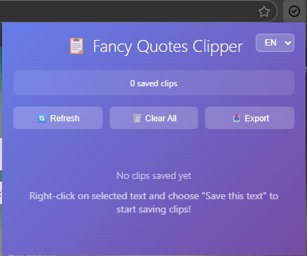

# Fancy Quote - Chrome Extension

A powerful Chrome extension for clipping and managing text selections from web pages with multilingual support.

## 📸 Screenshots

<div align="center">
  
</div>

## 🌟 Features

- **Text Clipping**: Select and save text from any webpage with a simple right-click
- **Multilingual Support**: Available in English, Vietnamese, and Czech languages
- **Smart Organization**: Clips are automatically sorted by timestamp with source URL tracking
- **Popup Interface**: Easy-to-use popup showing all your saved clips
- **Export Functionality**: Export your clips to JSON format for backup or sharing
- **Context Menu Integration**: Quick access through right-click context menu
- **Instant Copy**: One-click copying of saved text clips
- **Individual Management**: Delete specific clips or clear all at once

## 🚀 Installation

### From Source
1. Clone this repository:
   ```bash
   git clone https://github.com/curvecode/fancyquote_chrome_ext.git
   cd fancyquote_chrome_ext
   ```

2. Install dependencies:
   ```bash
   npm install
   ```

3. Build the extension:
   ```bash
   npm run build
   ```

4. Load the extension in Chrome:
   - Open Chrome and navigate to `chrome://extensions/`
   - Enable "Developer mode" in the top right
   - Click "Load unpacked" and select the `dist` folder

### From Chrome Web Store
*Coming soon - Extension will be available on Chrome Web Store*

## 📖 How to Use

### Basic Text Clipping
1. **Select text** on any webpage
2. **Right-click** and choose "Add to Fancy Quote" from the context menu
3. Your text is automatically saved with the source URL and timestamp

### Managing Your Clips
1. **Click the extension icon** in the Chrome toolbar
2. **View all clips** in the popup interface
3. **Copy clips** using the 📋 button
4. **Delete individual clips** using the 🗑️ button
5. **Export all clips** to JSON using the Export button
6. **Clear all clips** using the Clear All button

### Language Settings
1. Open the extension popup
2. Use the language dropdown to switch between:
   - **English** (en)
   - **Tiếng Việt** (vi) 
   - **Čeština** (cs)
3. The interface and context menu will update automatically

## 🛠️ Technical Details

### Built With
- **TypeScript** - Type-safe development
- **Vite** - Fast build tool and development server
- **Chrome Extension Manifest V3** - Latest extension platform
- **Chrome APIs**: Storage, Context Menus, Notifications, Scripting

### Project Structure
```
fancyquote_chrome_ext/
├── background.ts          # Service worker (background script)
├── content.ts            # Content script for text selection
├── popup.ts              # Popup interface logic
├── popup.html            # Popup interface HTML
├── manifest.json         # Extension configuration
├── _locales/             # Internationalization files
│   ├── en/messages.json  # English translations
│   ├── vi/messages.json  # Vietnamese translations
│   └── cs/messages.json  # Czech translations
├── icons/                # Extension icons
└── dist/                 # Built extension (after npm run build)
```

### Key Components

#### Background Service Worker
- Manages context menu creation and updates
- Handles storage operations and notifications
- Listens for language changes and updates UI accordingly

#### Content Script
- Minimal footprint script for text selection detection
- Communicates with background script for clip storage

#### Popup Interface
- Clean, responsive UI for clip management
- Real-time language switching
- Export functionality and clip organization

## 🌍 Internationalization

The extension supports multiple languages through Chrome's i18n API:

- **English (en)**: Default language
- **Vietnamese (vi)**: Full Vietnamese translation
- **Czech (cs)**: Complete Czech localization

All UI elements, context menus, and notifications are translated, providing a native experience for users in their preferred language.

## 🔧 Development

### Prerequisites
- Node.js 16+ 
- npm or yarn

### Development Setup
```bash
# Install dependencies
npm install

# Start development mode
npm run dev

# Build for production
npm run build

# Type checking
npm run type-check
```

### Adding New Languages
1. Create a new folder in `_locales/` with the language code (e.g., `fr/`)
2. Add `messages.json` with all required message keys
3. Update the language selector in `popup.html` and `popup.ts`
4. Add the language code to the validation arrays in the code

## 📝 Permissions

The extension requires the following permissions:

- **activeTab**: Access to the current tab for text selection
- **contextMenus**: Create right-click context menu items
- **storage**: Save and retrieve text clips
- **notifications**: Show success/error notifications
- **scripting**: Inject content scripts for text selection

## 🐛 Known Issues

- Large text selections (>5000 characters) may be truncated in the popup display
- Context menu language updates require a brief moment to sync across tabs

## 🤝 Contributing

1. Fork the repository
2. Create your feature branch (`git checkout -b feature/amazing-feature`)
3. Commit your changes (`git commit -m 'Add some amazing feature'`)
4. Push to the branch (`git push origin feature/amazing-feature`)
5. Open a Pull Request

## 📄 License

This project is licensed under the MIT License - see the [LICENSE](LICENSE) file for details.

## 🙏 Acknowledgments

- Built with modern Chrome Extension Manifest V3
- Inspired by the need for better text management across web browsing
- Icons and UI design follow Chrome's design guidelines

---

**Enjoy clipping and organizing your favorite text snippets with Fancy Quote! 🎯**